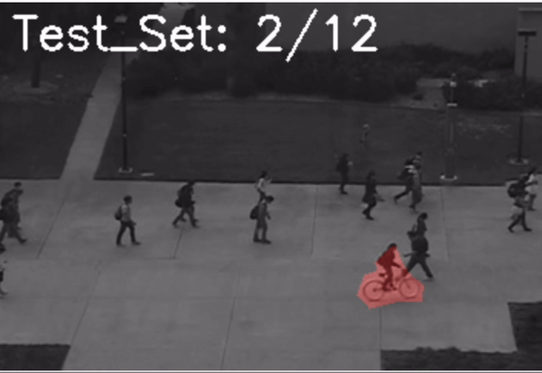

# Leveraging Reconstruction Loss in Adversarial Autoencoders to Detect Novelty
    


### Content  

### Code Files

Following are the details of the main code files in the repository. You may find a few other files that are mostly for debugging and defaults.

* **partition_mnist.py** - code for preparing MNIST dataset.
* **partition_fmnist.py** - code for preparing MNIST dataset Fashion-MNIST.
* **Testing_train_DATASETNAME.py** - code for training the datasets and it will automatically call  **train_AAE.py**.
* **train_AAE.py** - code for training the autoencoder.
* **Testing_test_DATASETNAME.py** - code for training the datasets and it will automatically call  **novelty_detector.py**.
* **novelty_detector.py** - code for running novelty detector.
* **net.py** - contains definitions of network architectures.
* **evaluation.py** - contains the evaluation criteria, AUC, F-measure and all.
* **DATASET_folds_visualization.py** - Used to visualize the dataset folds and see the proper distribution of 


### Folder Files

Following are the details of the main folder files in the repository. You may find a few other files that are created during run time 

* **configs** - Folder containing the important configurations for all the datasets in YAML format.
* **utils** - It contains the utility files used in the code that are called in testing.

### Preparing Datasets

The very first thing is to prepare datasets, this improved architecture can be tested on different datasets (Images and Videos). We have tested it on MNIST, Fashion-MNIST,Coil-100, and UCSD PED 2 video anomaly datasets.

run **partition_DATASETNAME.py**, with the dataset name to prepare the data into folds. 
For the Video dataset, the preprocessing needs to be done, the details are mentioned in the paper.

### Preparing Training

Alternatively, you can call directly functions from **train_AAE.py** and **novelty_detector.py**

Train autoencoder with **train_AAE.py**, you need to call *train* function:

```
data_list = [
    {
        "inliner_classes": #######,  # Mention your classes here
        "ic": ########   # index
    }
    # You can add more configurations like this:
     {"inliner_classes": [#######], "ic": #######}
]
for folding_id in range(5):  # Loop from 0 to 4
    for data in data_list:
        inliner_classes = data["inliner_classes"]
        ic = data["ic"]

        # inlier class set index (used to save model with unique filename)
        print(ic)
        train(folding_id, inliner_classes, ic, cfg)
```

  
   Args:
   -  folding_id: It will automatically iterate over all the 5-folds.
   -  inliner_classes: List of classes considered inliers.
   -  ic: inlier class set index (used to save model with unique filename).

  It will save the train models in the /model folder and also the reconstructions of the images after each epoch and logs are saved in the results folder.


   ### Preparing Testing
   
 After autoencoder was trained, from **novelty_detector.py**, you need to call *main* function:
```
 data_list = [
    {
        "inliner_classes": #######,
        "ic": ########   # index
    }
    # You can add more configurations like this:
     {"inliner_classes": [#######], "ic": #######}
]

total_classes = 100 
mul = 0.2
folds = 5

for folding_id in range(5):  # Loop from 0 to 4
    for data in data_list:
        inliner_classes = data["inliner_classes"]
        ic = data["ic"]

        novelty_detector.main(
            folding_id,
            inliner_classes, ic,
            total_classes,
            mul,
            folds, cfg
        )
```
        
   -  folding_id: Id of the fold. For MNIST, 5 folds are generated, so folding_id must be in range [0..5]
   -  inliner_classes: List of classes considered inliers.
   -  ic: inlier class set index (used to save the model with unique filename).
   -  total_classes: Total count of classes (deprecated, moved to config).
   -  mul: multiplier for power correction. Default value 0.2.
   -  folds: Number of folds (deprecated, moved to config).
   
### Generated/Reconstructed images, Frames and Videos




*MNIST Reconstruction. First raw - real image, second - reconstructed.*

<br><br>


*MNIST Reconstruction.*

<br><br>


*MNIST Reconstruction.*


<br><br>


*MNIST Reconstruction.*


<br><br>


*COIL100 and UCSD Reconstruction, single category. First raw - real image, second - reconstructed.*

<br><br>


*COIL100 Generation. First raw - real image, second - reconstructed. Only 57 images were used for training.*

<br><br>


*COIL100 Reconstruction, 7 categories. First raw - real image, second - reconstructed. Only about 60 images per category were used for training*

<br><br>


*COIL100 Generation. First raw - real image, second - reconstructed. Only about 60 images per category were used for training.*

<br><br>


*The Probability Distribution Function (PDF) shows the distribution of the data. In
this visualization, inliers, which are seven categories of images and represent
expected data points, form the core of the distribution. Alternatively, outliers
significantly diverge from the standard range and are highlighted as separate,
distinct peaks in the plot.*

<br><br>

